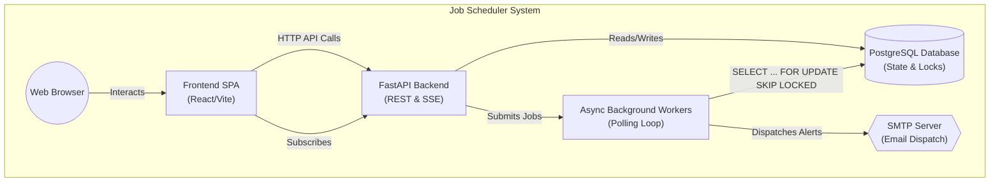
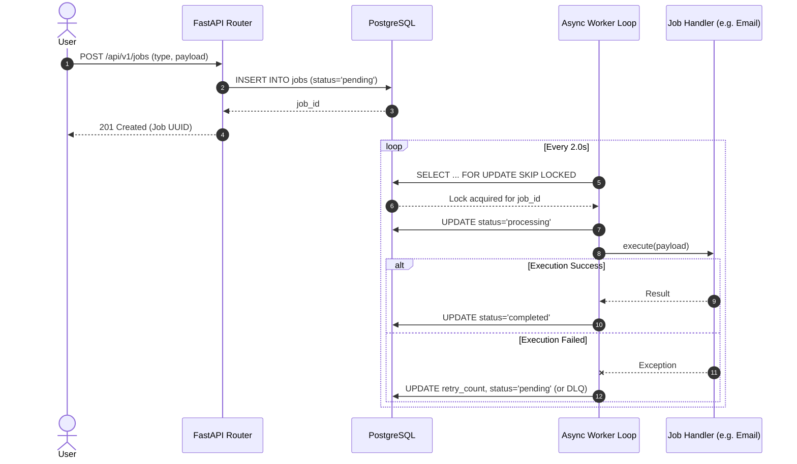
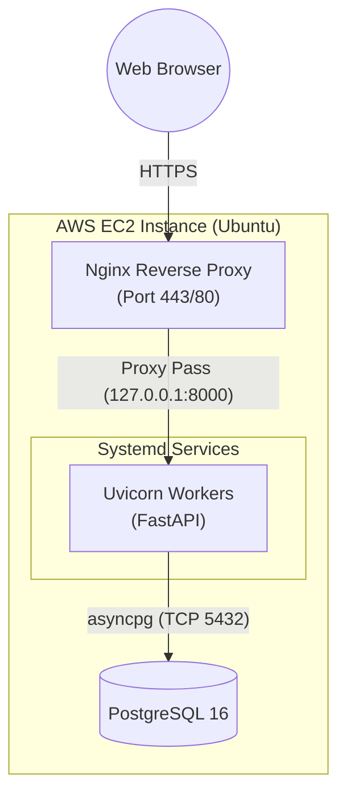

# Architecture Document: Job Scheduler

## Introduction and Goals

The Background Job Scheduler is an asynchronous, highly concurrent, and fault-tolerant distributed system designed to execute delayed tasks, recurring schedules, and complex Directed Acyclic Graph (DAG) workflows. 

**Key Business Goals:**
- **Zero-Duplicate Guarantees:** Ensure jobs are executed exactly once, even across horizontally scaled worker nodes.
- **Resilience:** Handle failure gracefully with jittered backoff retries and Dead Letter Queue (DLQ) alerts.
- **Observability:** Provide near-real-time monitoring dashboards, tracing capabilities, and Server-Sent Events (SSE) subscriptions for real-time state changes.

---

## System Overview

### High-Level Architecture
The diagram below illustrates the macro-level architecture of the system, showing how the frontend, backend, background workers, and external services interact.

### Core Components

1. **The HTTP API (FastAPI)**
   The API layer serves purely as the gateway for monitoring and managing the underlying data.
   - **Endpoints:** `/jobs` (CRUD), `/dlq` (Dead Letter Queue), `/inbox` (Processed emails).
   - **Streams:** `/sse/queue` (queue length), `/inbox/stream` (real-time email updates).

2. **Job Execution Model**
   - **Worker Loop:** Background coroutines (`worker_loop`) poll the database using `SELECT ... FOR UPDATE SKIP LOCKED`.
   - **Handlers:** Job execution logic is dispatched to a `ProcessPoolExecutor` or `ThreadPoolExecutor` depending on whether it's CPU-bound or I/O-bound to keep the `asyncio` event loop highly responsive.

3. **Scheduling Algorithms**
   The system implements four distinct algorithms for queueing:
   - **Min-Heap (Default):** Python's `heapq`. Best general-purpose balance of speed and memory footprint.
   - **Timing Wheel:** A hierarchical 2-level wheel. Provides `O(1)` amortized insertions. Fixed memory footprint.
   - **Indexed Priority Queue:** Augments binary heap with an inverse index array. Allows `O(log n)` decrease-key operations for efficient starvation prevention.
   - **Skip List:** A probabilistic structure with `O(log n)` expected time for operations.

4. **DAG Dependency Resolver**
   Jobs can define `dependencies` creating directed acyclic execution graphs.
   - **Cycle Detection:** A Depth-First Search (DFS) runs at workflow creation time to reject circular graphs.
   - **Execution Barrier:** The `SKIP LOCKED` query dynamically ensures a job is never picked up unless all parent dependencies have `status = 'completed'`.

---

## Runtime and Data Flow

### Job Lifecycle Data Flow
The sequence diagram below illustrates the exact lifecycle of a job, highlighting the non-blocking transaction boundaries and execution loops.

---

## Deployment Architecture

---

## Cross-Cutting Concerns

### Observability
- **Request Logging:** `RequestLoggingMiddleware` injects structured request context (`X-Request-ID`) into every log line.
- **Tracing:** All background jobs inherit trace IDs to correlate API requests directly with asynchronous background execution logs.

### Resiliency and Fault Tolerance
- **Exponential Backoff:** Retries are delayed exponentially (1s, 5s, 25s) with a randomized jitter (`±20%`) to prevent "thundering herd" database stampedes.
- **Dead Letter Queue (DLQ):** Jobs failing beyond their retry limit are parked in the DLQ.
- **Alerting:** An `alert_loop` monitors DLQ size and dispatches SMTP emails if thresholds are exceeded.

---

## Key Architecture Decisions (ADRs)

### ADR 1: PostgreSQL `SKIP LOCKED` over Redis
* **Context:** We needed a queue broker to distribute tasks.
* **Decision:** Instead of introducing a massive external dependency (Redis, RabbitMQ), we utilized PostgreSQL's `SELECT ... FOR UPDATE SKIP LOCKED`.
* **Consequences:** We achieve ACID transaction guarantees and zero duplicate processing across horizontal deployments while eliminating the network latency and deployment complexity of maintaining a separate Redis cluster. 

### ADR 2: Short-Polling + Server-Sent Events (SSE) over WebSockets
* **Context:** The frontend dashboard required real-time queue metrics and job status changes.
* **Decision:** Implemented a hybrid 1.5s sub-polling architecture for complex table views, paired with native Server-Sent Events (SSE) streams for global metrics.
* **Consequences:** WebSockets require complex state management and dedicated bidirectional framing. SSE operates cleanly over standard HTTP/1.1 (and HTTP/2 multiplexing), automatically reconnects via browser native APIs, and easily bypasses strict corporate firewalls. Short-polling provides near-real-time latency without exhausting open file descriptors on the backend.
